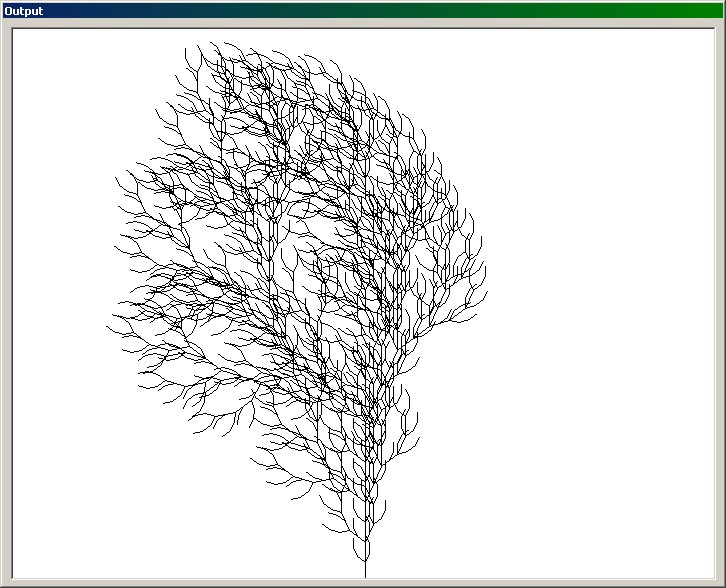



## LSystems

### Description

It generates a parallel rewriting system (Lindenmayer System). Take a look at the screen shot.
 
### More Info
 

             |
---                |---
**Submitted On**   |2002-04-12 19:44:58
**By**             |[Loreno Heer](https://github.com/Planet-Source-Code/PSCIndex/blob/master/ByAuthor/loreno-heer.md)
**Level**          |Advanced
**User Rating**    |5.0 (20 globes from 4 users)
**Compatibility**  |VB 6\.0
**Category**       |[Complete Applications](https://github.com/Planet-Source-Code/PSCIndex/blob/master/ByCategory/complete-applications__1-27.md)
**World**          |[Visual Basic](https://github.com/Planet-Source-Code/PSCIndex/blob/master/ByWorld/visual-basic.md)
**Archive File**   |[LSystems714124122002\.zip](https://github.com/Planet-Source-Code/loreno-heer-lsystems__1-33740/archive/master.zip)

